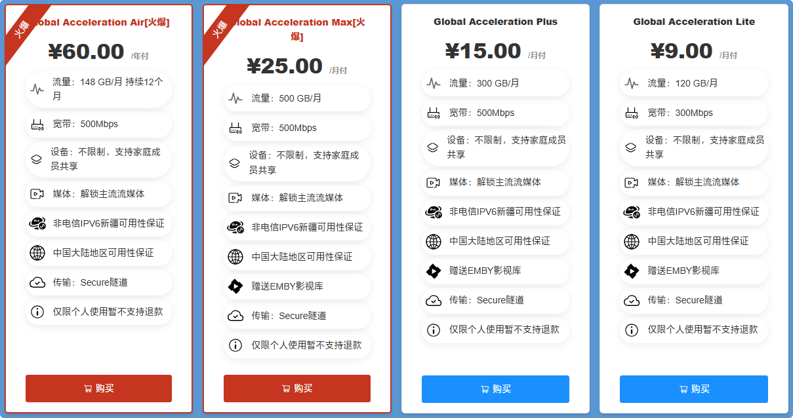
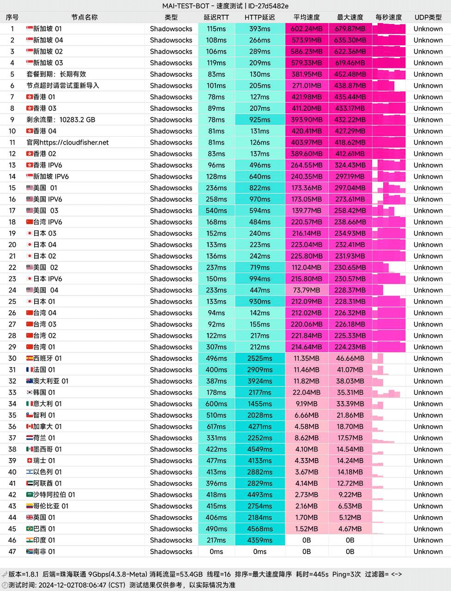

# 渔云机场官网cloudfisher地址2025最新入口 + 优惠码

**渔云机场跑路了吗？** cloudfisher跑路了吗？

暂时没有。但是机场天生就有跑路风险，老牌机场也有跑路的，为尽可能减少损失，选购套餐可按月支付。

下面是渔云机场cloudfisher最新地址：

永久官网：[cloudfisher.net](https://xuv.cc/out/fish) 

地址1：[cloudfisher.one](https://cloudfisher.one/web/#/login?code=qjem6QJz)

## 简介

渔云机场机场怎么样？cloudfisher是2024年新开机场，新站价格便宜，线路带宽充裕不拥挤。

超高性价比，150GB IEPL专线流量价格**仅需5元**，无需再使用任何优惠券。

全球网络覆盖：球拥有超过 25+ 个边缘网络，覆盖亚洲、欧洲、美洲等，且仍在持续增加。无论您身在国内何处，都可以享受高速稳定的连接。

IEPL 专线：所有的节点都使用 IEPL 专线，确保有保证的媒体流和流畅、快速的浏览体验。

## 渔云机场cloudfisher特色

<ul>
	<li>流量充足，价格便宜，低至￥5/月；</li>
	<li>不限制设备数量，支持家庭成员共享；</li>
	<li>IEPL专线节点，非电信ipv6新疆可用性保证；</li>
	<li>解锁主流流媒体；</li>
	<li>带宽500Mbps</li>
</ul>

## 渔云机场cloudfisher套餐价格

>Global Acceleration Air：60元/年，148GiB 每月流量，最高 500Mbps 速率 **（推荐）**；
>
>Global Acceleration Lite：9元/月，120GiB 月流量，最高 300Mbps 速率；
>
>Global Acceleration Plus：15元/月，300GiB 月流量，最高 500Mbps速率 **（推荐）**；
>
>Global Acceleration Max：25元/月，500GiB 月流量，最高 500Mbps 速率；

## 渔云机场cloudfisher优惠码

已经超低价了，[渔云机场](https://xuv.cc/out/fish)无需优惠码也是最低价！

## 渔云机场cloudfisher机场测速

